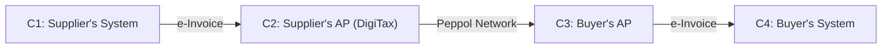
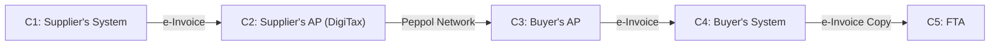

## Peppol

Peppol is an international framework that sets the standard for cross-border electronic document exchange, including e-invoicing. It enables secure, standardized, and interoperable data sharing between businesses and public sector entities across different countries and IT systems.

[Download the full Peppol specification](https://www.peppol.eu/downloads/peppol-specifications)

In summary, the key concepts behind the Peppol network are:

* **Access Point (AP):** A secure gateway that connects your business to the Peppol network, allowing you to send and receive electronic documents (like e-invoices) in a standardized format.
* **Service Metadata Publisher (SMP):** A decentralized directory that stores the receiving capabilities of a business, including the types of documents they can receive and the network address of their Access Point.
* **Service Metadata Locator (SML):** A centralized master directory that helps an Access Point locate the correct SMP where a receiver's details are registered, using their unique Peppol ID.

You are welcome to read more about the key concepts behind the Peppol network in [Peppol FAQs](https://www.peppol.eu/faq).

### 4-corner model vs. 5-corner model

The 4-corner model is a communication architecture that enables the exchange of e-invoices between businesses. It includes four parties: the supplier, the supplier's Peppol Access Point, the buyer's Peppol Access Point, and the buyer.

The 5-corner model extends the 4-corner model to include a fifth party, the tax authority. This enables the tax authority to receive copies of e-invoices and use them for compliance purposes.

This 5-corner model is the standard followed by the UAE's e-invoicing system. [Check the Peppol 5-corner model](https://www.peppol.eu/faq/peppol-5-corner-model) to learn more.

Let's cover the 4-corner model first, then we can cover the 5-corner model, and finally, we can cover how DigiTax implements both.

* C1: The Supplier's System (e.g., your ERP)
* C2: The Supplier's Peppol Access Point (DigiTax)
* C3: The Buyer's Peppol Access Point
* C4: The Buyer's System (e.g., their ERP)

## PINT-AE

PINT (Peppol International) is a specification that extends the Peppol network to support cross-border e-invoicing between businesses in different countries. It ensures that e-invoices can be exchanged seamlessly and securely across international borders, regardless of the different IT systems used by trading partners.

PINT-AE is the UAE's implementation of the PINT specification. It is a set of rules and guidelines that define how e-invoices should be created, exchanged, and processed in the UAE. It is based on the Peppol "5-corner" model, which includes:

* C1: The Supplier's System (e.g., your ERP)
* C2: The Supplier's Peppol Access Point (DigiTax)
* C3: The Buyer's Peppol Access Point
* C4: The Buyer's System (e.g., their ERP)
* C5: The Federal Tax Authority (FTA)

The [DigiTax API](ref:digitax-api) acts as your certified Peppol Access Point (C2), managing the connection, validation, and secure transmission of your e-invoices to the network, ensuring compliance with all FTA requirements.

You don't need to worry about the 4-corner model or the 5-corner model. You just need to worry about the [DigiTax API](ref:digitax-api).

### Peppol standard key components

The Peppol standard defines several key components that work together to enable this seamless exchange.

* **Digital Certificates**: Securely identify and authenticate trading partners
* **AS4 Protocol**: Standardized secure messaging protocol
* **Four-Corner Model**: Four-party communication architecture (supplier → their AP → buyer's AP → buyer)
* **Service Metadata Publisher (SMP)**: Directory of network participants and their capabilities

Together, these components ensure that e-invoices are delivered reliably, securely, and in a standardized format that all participants can understand.
